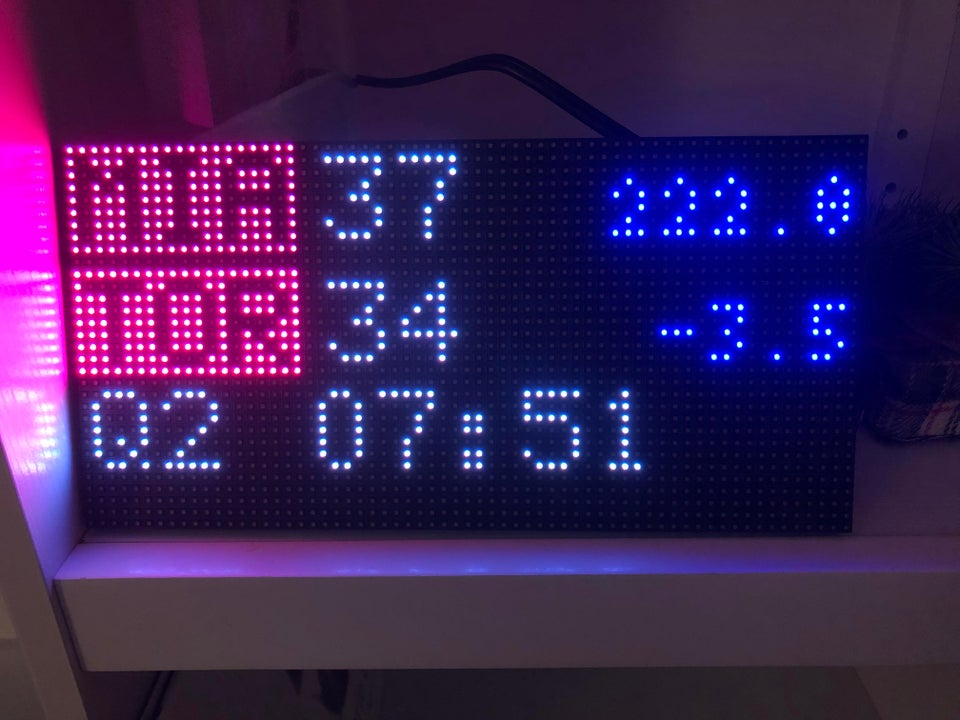
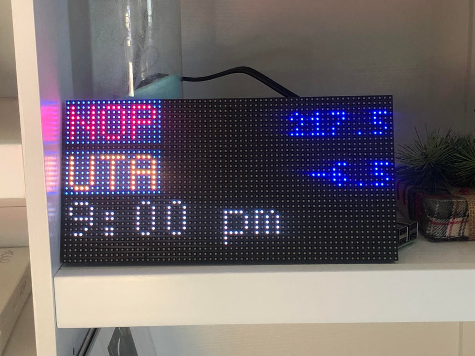

# NBA-scoreboard

## NBA LED Scoreboard
Displays NBA scores for the day on an LED board. Driven by a raspberry pi and currently only supports 32x64 boards.

 

### Issues
This is the first time I've shared a project so I'm sure there will be issues that you may encounter. Feel free to open a pull request or create an issue with any problems you have.


### Hardware
Currently setup for raspberry pi 3b+ and adafruit hat/bonnet. [The RGB Matrix library used](https://github.com/hzeller/rpi-rgb-led-matrix) has a good overview for adjusting matrix settings for filckering and other hardware options.

### Current Functionality
Scrolls through all NBA games for the day. New days begin on the first update after 12pm ET. Game odds are taken from Bovada and are updated until the game starts. Live game odds are not displayed, although this can be easily changed if desired. All game times are displayed as Eastern times (sorry this is what the CDN returns and I live in this time zone).

### Game Data
Game data is pulled from the NBA's CDN link. This link provides live game data for all games of the current day. The link returns data in JSON format. During live games, game data is updated every 2 minutes. Currently there is no documnetation on what other data could be provided by the CDN. I just happened to stumble upon the link while looking at the NBA's official website.

### Installation
Clone the repo using the following command:

`git clone https://github.com/bder222/NBA-scoreboard`

Then cd into the root directory:

`cd /home/pi/NBA-scoreboard`

Then run the install script:

`sudo ./install.sh`

### Usage
Three scripts are used to drive the board:
1. NBAData is used to update game statuses.

`sudo python3 /home/pi/NBA-scoreboard/NBA_Data.py`


2. Two scripts are used to update game odds.

`sudo python3 /home/pi/NBA-scoreboard/Spreads_New_Day.py`

and 

`sudo python3 /home/pi/NBA-scoreboard/Spreads_Update.py`


3. NBA_Render is used to render the games.

`sudo python3 /home/pi/NBA-scoreboard/NBA_Render.py`


The best way I have found to run all three is scheduling their use using crontab. To do this, execute the following command in a terminal window:

`sudo crontab -e`

Scroll down past the commented out section, and insert the following entries:

```@reboot sleep 20; sudo python3 /home/pi/NBAscoreboard/NBA_Data.py```

```@reboot sleep 20; sudo python3 /home/pi/NBA-scoreboard/NBA_Render.py```

```0 11 * * * sudo python3 /home/pi/NBA-scoreboard/Spreads_New_Day.py```

```0 */2 * * * sudo python3 /home/pi/NBA-scoreboard/Spreads_Update.py```

This will ensure NBAData and NBA_Render are run at reboot, spreads are updated every two hours and spreads for the new day are updated at 11:00am.

### Copyright
Be sure to read the terms of use section on the NBA's website. From what I understand, using this data is fine as long as it's not for commercial use.

### Licensing
This project uses the GNU Public License. If you intend to sell these, the code must remain open source.
